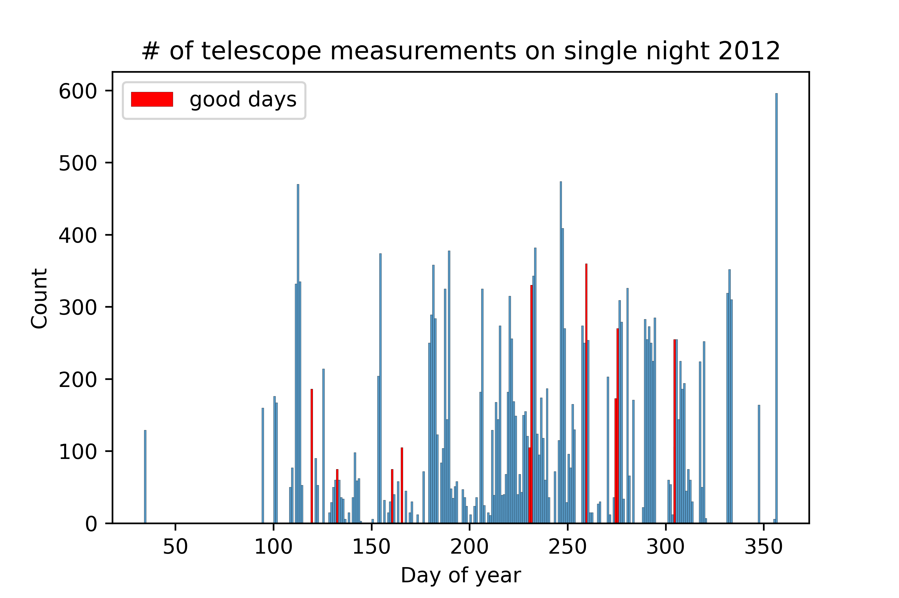

# Linear Regression from Scratch: Surveying Stars

This project was taken as 10% of third-year physics at the Univeristy of Cambridge. The project uses data from a telescope array to perform a linear regression to find the positions of the telescopes relative to eachother. The data can be used to form a matrix equation which can be inverted to find those telescope positions.

This project is readily accessible to almost any level of knowledge of maths, physics and coding. 

For those just interested in an overview of how everything fits together, a look at the [tutorial notebook](tutorial.ipynb) and the [project brief](project-brief.pdf) would be just fine. 

For those wanting to understand things a little deeper I have a few more resource to recommend...
- [My report](projectE-hs723.pdf) 
- [Initial paper](https://iopscience.iop.org/article/10.1086/430729/pdf)
- [CHARA website](https://www.chara.gsu.edu/public)
- [Numerical recipes](http://numerical.recipes/) 

I found this project very useful to learn... 
- Pandas 
- NumPy arrays and vectorisation
- Mathematics behind linear regression (design matrices and Moore-Penrose pseudoinverse)
- $\LaTeX$

Here are some of the cool visualisations ... 

